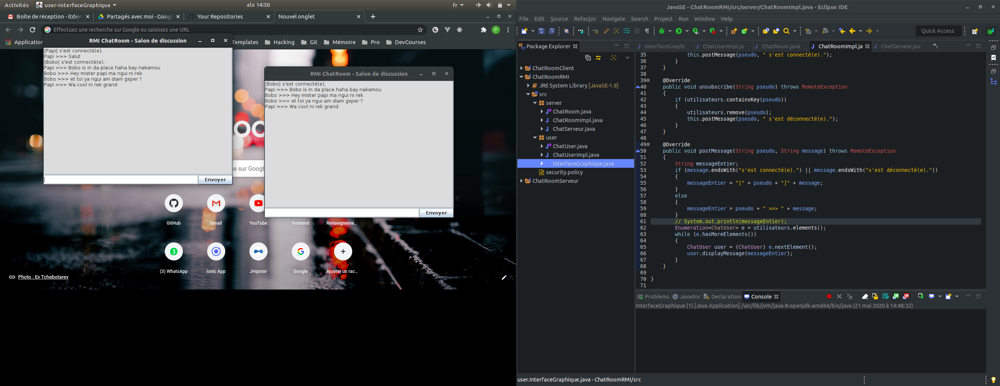

# Java RMI ChatRoom

Un simple ChatRoom ou salon de discussion en français, avec `Java` et l'interface de programmation `RMI`.

## Architecture du projet

Pour une meilleur organisation, le projet est découpé suivant les `packages` suivants :

- `server` contient les classes metiers de l'app (ici `User.java` et `Message.java`).

- `client` contient tout ce qui concerne la partie client comme l'interface graphique (`Gui.java`)
ainsi que la logique d'interaction avec le serveur soap (`Client.java`).

## Notes

Démarrez d'abord le serveur, en l'occurence `server.ChatServeur.java`, puis autant d'instances clientes que vous le souhaitez, matérialiser par `user.InerfaceGraphique.java`.

Bon chat !!!!

